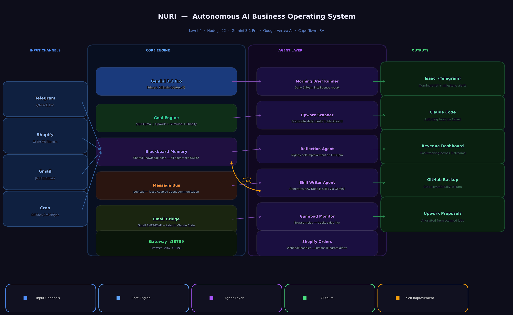

# Nuri — Autonomous AI Business Operating System



A Level 4 autonomous AI agent that runs 24/7 on a MacBook Air M1, managing freelance income across 3 streams without manual intervention.

## What Makes It Level 4

| Level | Capability | Nuri |
|---|---|---|
| 1 | Responds to commands | Yes |
| 2 | Runs on a schedule | Yes |
| 3 | Self-monitors and recovers | Yes |
| 4 | **Self-improves based on experience** | **Yes** |

## Architecture

### Input Channels
- **Telegram** — natural language commands from Isaac
- **Shopify** — order webhooks (real-time)
- **Gmail** — [NURI] emails from Claude Code
- **Cron** — 6:50am daily + midnight checks

### Core Engine
- **Gemini 3.1 Pro** — primary AI brain (Vertex AI)
- **Goal Engine** — tracks $8,333/month across Upwork + Gumroad + Shopify
- **Blackboard Memory** — shared knowledge base all agents read and write
- **Message Bus** — pub/sub agent communication (zero coupling)
- **Email Bridge** — Gmail SMTP/IMAP, talks to Claude Code autonomously
- **Gateway :18789** — API layer + Browser Relay :18791

### Agent Layer
- **Morning Brief Runner** — 6:50am daily intelligence report to Telegram
- **Upwork Scanner** — scans for jobs, posts to blackboard
- **Reflection Agent** — 11:30pm nightly self-improvement loop
- **Skill Writer Agent** — generates new Node.js skills via Gemini
- **Gumroad Monitor** — browser relay, tracks sales live
- **Shopify Orders** — webhook handler, instant Telegram alerts

### Outputs
- **Isaac (Telegram)** — morning briefs + milestone alerts
- **Claude Code** — auto bug fixes via Gmail when Nuri crashes 3x/hour
- **Revenue Dashboard** — goal tracking across 3 streams
- **GitHub Backup** — auto-commit at 4am daily
- **Upwork Proposals** — AI-drafted from scanned job listings

## Self-Improvement Loop

Every night at 11:30pm, the Reflection Agent:
1. Reads all logs from the day
2. Reads blackboard (what every agent found)
3. Reads goal state (how close to target)
4. Sends everything to Gemini for analysis
5. Gets back: what worked, what failed, what to do tomorrow
6. Posts insights to blackboard for all agents to read next day

## Stack

```
Runtime     Node.js 22
AI          Gemini 3.1 Pro (Vertex AI) — primary
            Gemini 2.5 Flash — lightweight tasks
Messaging   Telegram Bot API, Gmail SMTP/IMAP
Commerce    Shopify Admin API, Gumroad (browser relay)
Platform    OpenClaw 2026.3.23-2
Hardware    MacBook Air M1, macOS
```

## Want Something Like This?

This architecture can be adapted for any business:
- Replace Upwork scanner with your lead source
- Replace Shopify with your e-commerce platform
- Replace Gmail bridge with your notification system
- Keep the Goal Engine, Blackboard, and Reflection Agent

**Price: R35,000 setup + R8,000/month**
Delivery: 2 weeks

Contact: Sibomana Isaac — github.com/siboisaac190-eng
